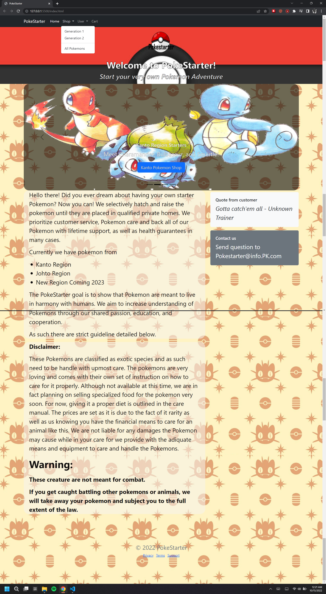
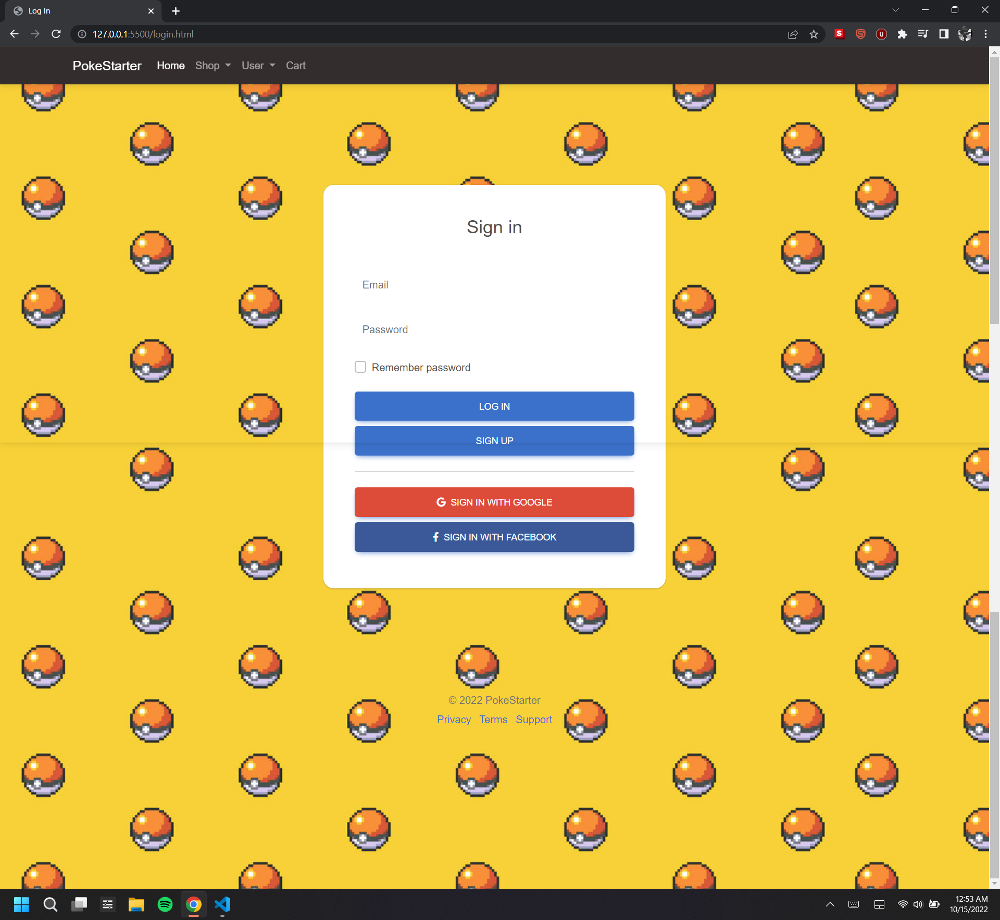
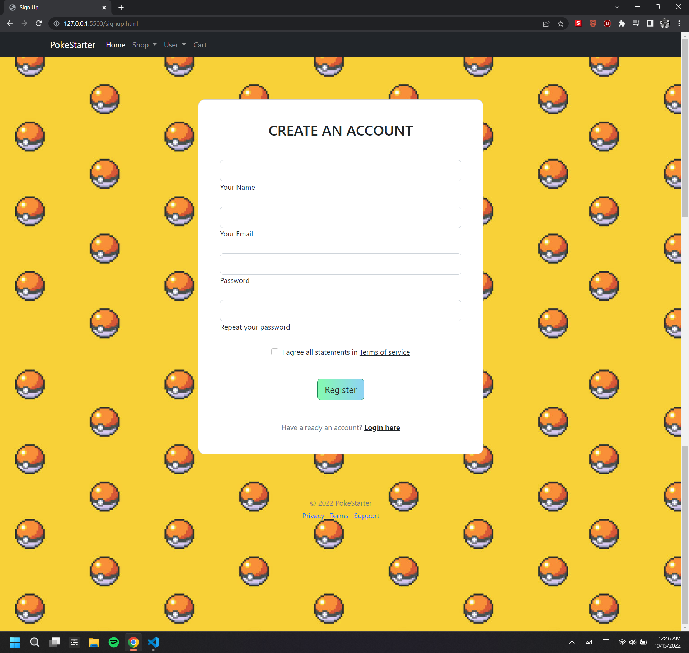
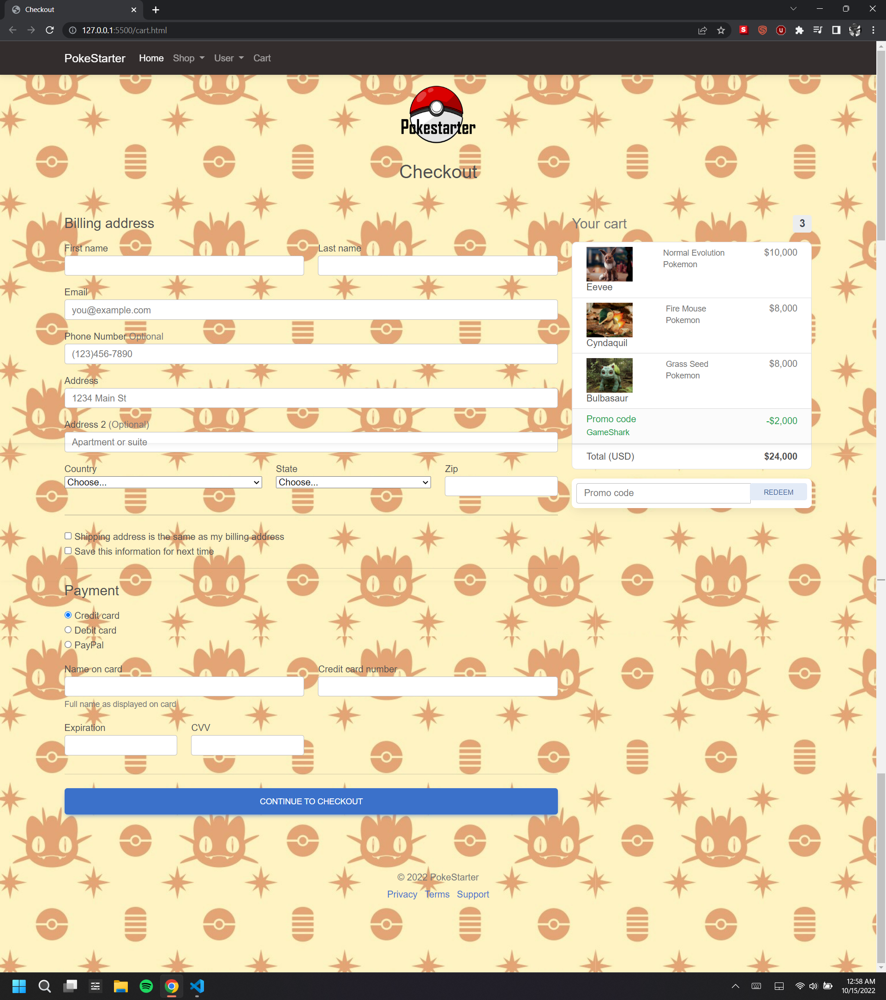

# PokemonWebsite

Log date 10/14/2022
Welcome, 
Thanks for checking out the code for the website.
A little bit about me, I originally wrote this code as a student learning to use HTML, CSS, and Bootstrap as a project.
The project started 10/10/2022 and that when I started writing this website code.
The project ended on 10/14/2022 and the Version 1 website is what I managed to accomplish in that time frame.
You might have notice that there is no working Javascript, we didn't cover that in class yet.
when we start learning it I might revisit this project to improve the code, and organize the images.
The website so far has been checked with W3validator and there is no error with any page.

My project is a commerce website in which you can buy select Pokemons from the popular game Pokemon. The website currently has only five pages but they are all linked together and you can navigate freely between them. The five pages are a Index (Home) page, Shop page, Log In page, Sign Up page, and lastly the cart page.

Below you will find images to each of my pages for the website

This is for the index page:
 

This is for the Shop page:
 

This is for the Log In page:
 

This is for the Sign Up page:
 

This is for the Cart page:
 

A piece of code that I greatly enjoyed playing around with was the carousel code in the index.html page.
I spent a good bit of time trying to mess around with the size to better suit my page as well as playing around with the amount of slide I wanted to use.